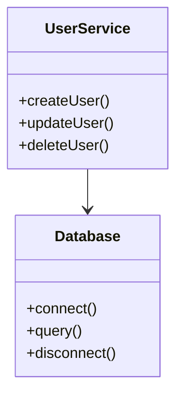

# Symref - Symbol Reference Analyzer for TypeScript

[](https://badge.fury.io/js/symref)

> **Note**: This package was previously published as `ai-code-static-checker`

## 背景と課題

近年、Cursor Composer、Wind Surf、CleinなどのAIコードエージェントが開発現場で活用されています。これらのエージェントは開発者の生産性を大幅に向上させる一方で、コンテキストウィンドウの物理的な制限により、コードベース全体を完全に理解できないという根本的な課題があります。

### AIコードエージェントが直面する主な課題

1. **コンテキストの限界による問題**
   - コードベース全体を一度に把握できない
   - エントリーポイントからの呼び出し関係が見えない
   - 依存関係の全体像が把握できない

2. **不適切な修正位置の選択**
   - 本来修正すべき箇所とは異なる場所を変更
   - 新規コードの不適切な配置
   - インターフェースの実装箇所を見落とし

3. **依存関係の見落とし**
   - 新たに書いたコードを上位ロジックから呼び出さずに古いバージョンを継続利用
   - インターフェースの変更に追従できていない実装
   - 関連するファイルやモジュールへの影響を考慮できない

4. **デッドコードの生成**
   - 既存の実装を見落として重複コードを生成
   - 古い実装が残ったまま新しい実装を追加
   - 参照されなくなったコードの放置

これらの問題は、コードベースが大きくなり関連性が複雑になればなるほど深刻化します。
一度このような問題が発生すると、AIコードエージェントによる修正も困難になります。なぜなら：

1. **コンテキストの分断**
   - 問題のある箇所を特定できない
   - 修正すべき箇所を見落とす
   - 部分的な修正による新たな問題の発生

2. **累積的な影響**
   - 不完全な修正の積み重ね
   - デッドコードの増加
   - コードベースの品質低下

（実例：上手くいくまでディスカードを繰り返した結果、Cline（Claude3.5 Sonnet）の請求が$500に達したケースがありました。これは、コンテキストの制限により効率的な修正ができなかったことが原因です。）

これらの課題に対して、symrefは以下のような解決策を提供します：

## 解決策：静的解析アプローチ

このツールは、AIコードエージェントによる変更の前後で静的解析を実行し、より正確で信頼性の高いコード修正を実現することを目指しています。
コードベース全体の構造を解析し、依存関係やインターフェースの整合性を検証することで、潜在的な問題を事前に検出します。

### 主な機能

1. **シンボル参照解析**
   - 関数、クラス、インターフェース、メソッド、プロパティの使用箇所を正確に特定
   - 同名の異なるシンボルを正しく区別
   - 変数名の偶然の一致を除外
   - 依存関係の自動検出
   - 変更影響範囲の可視化

2. **ファイル参照チェック**
   - ファイル間の依存関係分析
   - 循環参照の検出
   - デッドコードの特定

3. **呼び出しグラフ分析**
   - 関数やメソッド間の呼び出し関係の可視化
   - シンボル間の呼び出し経路の追跡
   - 呼び出し元の分析
   - Mermaid形式でのグラフ出力

### AIエージェントサポート

以下のAIコードエージェント用のルール定義を提供しています。内容はすべて同じです。

- `.cursorrules` - Cursor用の静的解析ルール
- `.windsurf/rules.json` - Windsurf用の静的解析ルール
- `.clinerules` - Cline用の静的解析ルール

## インストールと使い方

### インストール

```bash
npm install --save-dev symref
```

または

```bash
yarn add --dev symref
```

### 基本的な使い方

インストール後、以下の2つの方法で実行できます：

1. npxを使用する方法：
```bash
npx symref refs MyClass
```

2. package.jsonのscriptsに追加する方法：
```json
{
  "scripts": {
    "refs": "symref refs",
    "dead": "symref dead",
    "trace": "symref trace",
    "callers": "symref callers"
  }
}
```

その後、以下のように実行します：
```bash
npm run refs MyClass
```

### コマンドとオプション

#### `refs` - シンボル参照の解析

指定したシンボル（クラス、関数、変数など）がコードベース内でどこで参照されているかを分析します。

```bash
symref refs [symbol] [options]
```

**使用例:**
```bash
# 単一シンボルの参照を検索
symref refs MyClass

# カンマまたはスペース区切りで複数シンボルを指定
symref refs "MyClass MyFunction"
symref refs "MyClass,MyFunction"

# 内部参照も含めて検索
symref refs MyClass --all
```

**オプション:**
- `-d, --dir <path>`: 解析対象ディレクトリ
- `-p, --project <path>`: TypeScript設定ファイル
- `--include <pattern>`: 対象ファイルパターン（カンマ区切りで複数指定可能）
- `--exclude <pattern>`: 除外ファイルパターン（カンマ区切りで複数指定可能）
- `-a, --all`: 内部参照も含める

#### `dead` - 未使用コードの検出

ファイル内で定義されているが、他のファイルから参照されていないシンボルを検出します。

```bash
symref dead [file] [options]
```

**使用例:**
```bash
# 単一ファイルの未参照シンボルを検出
symref dead src/file.ts

# カンマまたはスペース区切りで複数ファイルを指定
symref dead "src/file1.ts src/file2.ts"
symref dead "src/file1.ts,src/file2.ts"

# スペースを含むファイル名はクォートで囲む
symref dead "src/file with space.ts"
```

**オプション:**
- `-d, --dir <path>`: 解析対象ディレクトリ
- `-p, --project <path>`: TypeScript設定ファイル
- `--include <pattern>`: 対象ファイルパターン（カンマ区切りで複数指定可能）
- `--exclude <pattern>`: 除外ファイルパターン（カンマ区切りで複数指定可能）

#### `trace` - 呼び出しグラフの分析

特定のシンボルから別のシンボルへの呼び出し経路を分析します。

```bash
symref trace "from --to=to" [options]
```

**使用例:**
```bash
# main関数からUserService.updateUserEmailへの呼び出し経路を分析
symref trace "main --to=UserService.updateUserEmail"

# 呼び出し経路をMermaidグラフとして出力
symref trace "main --to=UserService.updateUserEmail" --mermaid call_graph
```

**オプション:**
- `-d, --dir <path>`: 解析対象ディレクトリ
- `-p, --project <path>`: TypeScript設定ファイル
- `--include <pattern>`: 対象ファイルパターン（カンマ区切りで複数指定可能）
- `--exclude <pattern>`: 除外ファイルパターン（カンマ区切りで複数指定可能）
- `--mermaid <file>`: Mermaid形式のグラフファイルを出力

#### `callers` - 呼び出し元の分析

特定のシンボルがコードベース内でどこから呼び出されているかを分析します。

```bash
symref callers [symbol] [options]
```

**使用例:**
```bash
# 単一シンボルの呼び出し元を分析
symref callers MyFunction

# カンマまたはスペース区切りで複数シンボルを指定
symref callers "MyFunction MyClass.method"
symref callers "MyFunction,MyClass.method"

# 呼び出し元をMermaidグラフとして出力
symref callers MyFunction --mermaid callers_graph
```

**オプション:**
- `-d, --dir <path>`: 解析対象ディレクトリ
- `-p, --project <path>`: TypeScript設定ファイル
- `--include <pattern>`: 対象ファイルパターン（カンマ区切りで複数指定可能）
- `--exclude <pattern>`: 除外ファイルパターン（カンマ区切りで複数指定可能）
- `--mermaid <file>`: Mermaid形式のグラフファイルを出力

### 共通オプション

すべてのコマンドで使用できる共通オプション：

- `--help`: ヘルプメッセージの表示
- `--version`: バージョン情報の表示
- `--debug`: デバッグモードの有効化
- `--quiet`: 出力の抑制

### 出力形式

1. **シンボル参照解析の出力**
```json
{
  "symbol": "MyClass",
  "type": "class",
  "definition": {
    "filePath": "src/MyClass.ts",
    "line": 10,
    "column": 5,
    "context": "class MyClass"
  },
  "references": [
    {
      "filePath": "src/other.ts",
      "line": 20,
      "column": 15,
      "context": "new MyClass()"
    }
  ],
  "isReferenced": true
}
```

2. **Mermaid形式（呼び出しグラフ）**


### エラーメッセージ

主なエラーメッセージとその対処方法：

1. **ファイル関連**
   - `ファイルが見つかりません: <file>`
     - ファイルパスが正しいか確認
     - 指定したディレクトリにファイルが存在するか確認
     - ファイルの読み取り権限を確認

2. **シンボル関連**
   - `シンボル '<symbol>' が見つかりません`
     - シンボル名が正しいか確認
     - シンボルが定義されているファイルが解析対象に含まれているか確認
     - 大文字小文字が一致しているか確認

3. **解析エラー**
   - `アナライザーの初期化に失敗しました`
     - TypeScript設定ファイルが正しいか確認
     - 必要な依存関係がインストールされているか確認

## 開発者向け情報

### アーキテクチャ

```
src/
├── analyzer/     # 静的解析エンジン
│   ├── SymbolReferenceAnalyzer.ts  # シンボル参照解析
│   ├── CallGraphAnalyzer.ts        # 呼び出しグラフ分析
│   ├── SymbolFinder.ts            # シンボル検索
│   └── ProjectManager.ts          # プロジェクト管理
├── types/        # 型定義
│   ├── CallGraphTypes.ts          # 呼び出しグラフ関連の型
│   ├── SymbolTypes.ts            # シンボル関連の型
│   └── AnalyzerOptions.ts        # 解析オプションの型
├── cli/          # コマンドラインインターフェース
│   ├── commands/                 # 各コマンドの実装
│   └── formatters/              # 出力フォーマッター
└── utils/        # ユーティリティ関数
```

### 主要な機能の実装詳細

1. **シンボル参照解析**
   - TypeScriptのAST解析による正確な参照検出
   - クラスメンバー（メソッド、プロパティ）の個別参照分析
   - 内部参照と外部参照の区別

2. **呼び出しグラフ分析**
   - 深さ優先探索による呼び出しパスの検索
   - 逆方向の呼び出し元検索
   - Mermaid形式でのグラフ出力

3. **デッドコード検出**
   - トップレベルのシンボル分析
   - クラスメンバーの参照分析
   - エクスポートされたシンボルの特別処理

### パフォーマンス最適化

1. **キャッシュ戦略**
   - プロジェクトのキャッシュ
   - 解析結果のキャッシュ
   - ファイルシステムのキャッシュ

2. **メモリ管理**
   - 大規模プロジェクトの処理
   - メモリリークの防止
   - リソースの解放

### 出力ディレクトリの管理

symrefは、グラフファイルなどの出力を`.symbols`ディレクトリで一元管理します：

1. **自動ディレクトリ作成**
   - `.symbols`ディレクトリが自動的に作成されます
   - `.gitignore`ファイルも自動生成され、出力ファイルがGitの管理対象外となります

2. **タイムスタンプ付きファイル名**
   - 出力ファイルには自動的にタイムスタンプが付与されます
   - 形式：`{basename}_{YYYYMMDD}_{HHMM}.md`
   - 例：`trace_main_to_UserService_20240316_1205.md`

3. **ファイル管理**
   - 古い出力ファイルは自動的に上書きされません
   - 必要に応じて手動でクリーンアップできます

### グラフの可視化

symrefは、Mermaid形式でグラフを出力します。以下の方法で可視化できます：

1. **GitHub上での表示**
   - 生成されたMarkdownファイルをGitHubにプッシュすると、自動的にグラフが表示されます
   - プルリクエストやイシューにも直接貼り付けることができます

2. **Mermaid Live Editor**
   - https://mermaid.live で開いて表示
   - エディタ上で編集や調整が可能
   - PNG/SVG形式でエクスポート可能

3. **VSCode拡張機能**
   - Mermaid Preview拡張機能をインストール
   - エディタ上で直接プレビュー可能

### 使用例：

#### シンボル参照の検索

特定のシンボルの参照を全て検索します：

```bash
symref refs myFunction
```

複数のシンボルを一度に検索：

```bash
symref refs myFunction myClass myVariable
```

#### クラス.メソッド検索の例

クラスのメソッドや特定のプロパティを検索する場合は、ドット記法を使用できます：

```bash
# クラスのメソッド参照を検索
symref refs MyClass.myMethod

# 複数のクラスメソッド参照を検索
symref refs MyClass.method1 OtherClass.method2

# クラスのメソッド呼び出し元を検索
symref callers MyClass.myMethod

# クラスメソッド間の呼び出し経路を分析
symref trace FirstClass.method1 SecondClass.method2
```

ネストしたプロパティアクセス（例：`ClassName.prototype.methodName`）も同様に検索できます。

#### 呼び出し元の分析

特定のシンボルの呼び出し元をすべて分析します：

```bash
symref callers myFunction
```
