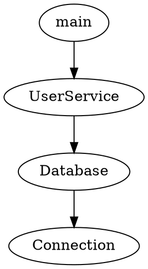

# Symref API仕様書

## 1. コマンドラインインターフェース

### 1.1 基本コマンド

#### `refs` - シンボル参照の解析

```bash
symref refs [symbol] [options]
```

オプション:
- `-d, --dir <path>`: 解析対象ディレクトリ
- `-p, --project <path>`: TypeScript設定ファイル
- `--include <pattern>`: 対象ファイルパターン
- `--exclude <pattern>`: 除外ファイルパターン

#### `dead` - 未使用コードの検出

```bash
symref dead [file] [options]
```

オプション:
- `--tsconfig <path>`: TypeScript設定ファイル
- `--include <pattern>`: 対象ファイルパターン
- `--exclude <pattern>`: 除外ファイルパターン

#### `trace` - 呼び出しグラフの分析

```bash
symref trace [path] [options]
```

オプション:
- `--from <symbol>`: 開始シンボル
- `--to <symbol>`: 終了シンボル
- `--max-depth <number>`: 最大深さ
- `--format <format>`: 出力フォーマット

### 1.2 共通オプション

- `--help`: ヘルプメッセージの表示
- `--version`: バージョン情報の表示
- `--debug`: デバッグモードの有効化
- `--quiet`: 出力の抑制

## 2. プログラムAPI

### 2.1 主要なクラスとインターフェース

#### SymbolAnalyzer

```typescript
class SymbolAnalyzer {
  constructor(options?: AnalyzerOptions);
  
  analyzeSymbol(symbolName: string): Promise<SymbolAnalysis>;
  findReferences(symbol: Symbol): Promise<Reference[]>;
  buildDependencyGraph(): Promise<DependencyGraph>;
  findDeadCode(file: string): Promise<DeadCodeAnalysis>;
  traceCallGraph(options: TraceOptions): Promise<CallGraph>;
}
```

#### CallGraph

```typescript
class CallGraph {
  addNode(symbol: Symbol): void;
  addEdge(from: Symbol, to: Symbol): void;
  findPath(start: Symbol, end: Symbol): Path[];
  toJSON(): string;
  toDot(): string;
}
```

### 2.2 型定義

#### SymbolAnalysis

```typescript
interface SymbolAnalysis {
  symbol: Symbol;
  references: Reference[];
  declarations: Declaration[];
  dependencies: Dependency[];
  metadata: {
    isExported: boolean;
    isPrivate: boolean;
    isDeprecated: boolean;
  };
}
```

#### Reference

```typescript
interface Reference {
  symbol: Symbol;
  location: Location;
  context: string;
  type: ReferenceType;
}
```

#### SymbolType

```typescript
type SymbolType = 
  | 'function'
  | 'class'
  | 'interface'
  | 'variable'
  | 'method'
  | 'property'
  | 'enum'
  | 'function-component'  // React関数コンポーネント
  | 'class-component'     // Reactクラスコンポーネント
  | 'potential-component' // 潜在的なReactコンポーネント
  | 'react-hook'          // React Hook
  | 'component';          // 一般的なコンポーネント
```

#### CallGraph

```typescript
interface CallGraph {
  nodes: Symbol[];
  edges: Edge[];
  metadata: {
    cycles: Cycle[];
    entryPoints: Symbol[];
    exitPoints: Symbol[];
  };
}
```

### 2.3 React対応機能

#### JSXタグ参照の検出

```typescript
// JSXタグによる参照を検出するためのAPI
class SymbolFinder {
  // ...既存のメソッド...
  
  /**
   * JSXタグを含むすべての参照を収集
   * @param symbolName 検索対象のシンボル名
   * @param includeJsxTags JSXタグによる参照も含めるかどうか
   * @returns 参照情報の配列
   */
  collectReferences(symbolName: string, includeJsxTags = true): Reference[];
}
```

#### コンポーネント定義の検出

```typescript
// Reactコンポーネントの定義を検出するAPI
class NodeUtils {
  // ...既存のメソッド...
  
  /**
   * ノードのシンボルタイプを判定（Reactコンポーネント対応）
   * @param node 対象ノード
   * @returns シンボルタイプ
   */
  determineSymbolType(node: Node): SymbolType;
  
  /**
   * ノードがReactコンポーネントかどうかを判定
   * @param node 対象ノード
   * @returns コンポーネントの場合true
   */
  isReactComponent(node: Node): boolean;
}
```

#### 呼び出しグラフでのJSXタグ対応

```typescript
// JSXタグを呼び出し関係として扱うためのAPI
class CallGraphAnalyzer {
  // ...既存のメソッド...
  
  /**
   * JSXタグを含む呼び出し関係を構築
   * @param callGraphNode 呼び出し元ノード
   * @param node 対象ノード
   */
  processJsxElements(callGraphNode: CallGraphNode, node: Node): void;
  
  /**
   * React Hooksの呼び出し関係を記録
   * @param caller 呼び出し元ノード
   * @param hookName フック名
   * @param callNode 呼び出し箇所のノード
   */
  recordHookCallRelationship(caller: CallGraphNode, hookName: string, callNode: Node): void;
}
```

## 3. 設定ファイル

### 3.1 基本設定

```json
{
  "dir": "./src",
  "project": "./tsconfig.json",
  "include": ["**/*.ts", "**/*.tsx"],
  "exclude": ["**/node_modules/**"],
  "maxDepth": 10,
  "strictMode": true
}
```

### 3.2 解析ルール

```json
{
  "rules": {
    "noUnusedExports": true,
    "noCircularDependencies": true,
    "maxDependencyDepth": 5
  }
}
```

## 4. 出力フォーマット

### 4.1 JSON形式

```json
{
  "symbol": {
    "name": "MyClass",
    "type": "class",
    "location": {
      "file": "src/MyClass.ts",
      "line": 10,
      "column": 5
    }
  },
  "references": [
    {
      "location": {
        "file": "src/other.ts",
        "line": 20,
        "column": 15
      },
      "context": "new MyClass()"
    }
  ]
}
```

### 4.2 DOT形式（呼び出しグラフ）



## 5. エラーコード

### 5.1 システムエラー

- `E001`: ファイルが見つからない
- `E002`: 設定ファイルの読み込みエラー
- `E003`: メモリ不足

### 5.2 解析エラー

- `E101`: 構文エラー
- `E102`: 型エラー
- `E103`: 循環参照

### 5.3 警告

- `W001`: 未使用のエクスポート
- `W002`: 深い依存関係
- `W003`: 非推奨APIの使用 