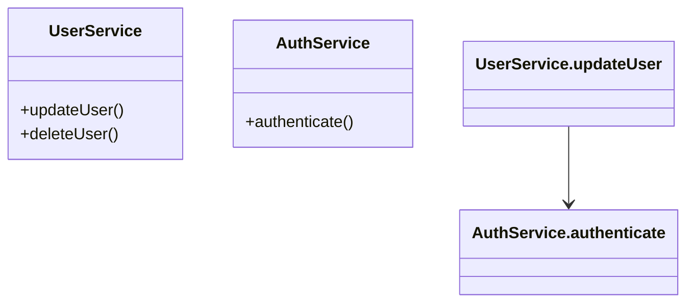

# 呼び出しグラフ分析（Call Graph Analyzer）設計書

## 1. 概要

呼び出しグラフ分析機能は、TypeScriptプロジェクト内の関数やメソッド間の呼び出し関係を分析し、その依存関係をグラフとして可視化する機能です。

## 2. 機能要件

### 2.1 基本機能
- 関数間の呼び出し関係の追跡
- メソッド間の呼び出し関係の追跡
- 呼び出し経路の特定
- 循環参照の検出
- グラフの可視化（Mermaid形式）
- 特定シンボル間のパス検索
- 全呼び出し元の検索と分析

### 2.2 解析対象
- 関数呼び出し
- メソッド呼び出し
- コンストラクタ呼び出し
- イベントハンドラ
- コールバック関数
- 非同期関数
- プロパティアクセス経由の呼び出し

## 3. 技術設計

### 3.1 コアコンポーネント

```typescript
// 呼び出しグラフのノード
interface CallGraphNode {
    symbol: string;
    type: string;
    location: SymbolLocation;
    callers: CallGraphNode[];
    callees: CallGraphNode[];
}

// シンボルの位置情報
interface SymbolLocation {
    filePath: string;
    line: number;
    column: number;
    context: string;
}

// 呼び出し経路
interface CallPath {
    nodes: CallGraphNode[];
    edges: CallEdge[];
    startSymbol: string;
    endSymbol: string;
}

// 呼び出しエッジ
interface CallEdge {
    caller: CallGraphNode;
    callee: CallGraphNode;
    location: SymbolLocation;
}

// 呼び出しグラフ分析結果
interface CallGraphResult {
    paths: CallPath[];
    totalPaths: number;
    graphMermaidFormat?: string;
    outputPath?: string;
}
```

### 3.2 解析プロセス

1. **初期化フェーズ**
   - プロジェクトの初期化
   - 出力ディレクトリの設定
   - 解析設定の読み込み

2. **グラフ構築フェーズ**
   - 関数定義の収集
   - クラス定義の処理
   - 呼び出し関係の解析
   - エッジ情報の収集

3. **パス解析フェーズ**
   - 深さ優先探索による経路探索
   - 全パスの列挙
   - 循環参照の検出

4. **可視化フェーズ**
   - Mermaid形式への変換
   - クラス図の生成
   - メソッド間の関係の可視化

## 4. 実装詳細

### 4.1 コールグラフ解析クラス

```typescript
class CallGraphAnalyzer {
    private project: Project;
    private nodeUtils: NodeUtils;
    private callGraph: Map<string, CallGraphNode>;
    private outputDir: string;

    constructor(project: Project, outputDir: string = '.symbols') {
        this.project = project;
        this.nodeUtils = new NodeUtils();
        this.callGraph = new Map<string, CallGraphNode>();
        this.outputDir = outputDir;
        this.ensureOutputDir();
    }

    // 呼び出しグラフの構築
    public buildCallGraph(): number;

    // 特定シンボル間のパス検索
    public findPathsFromTo(fromSymbol: string, toSymbol: string): CallGraphResult;

    // 全呼び出し元の検索
    public findAllCallers(symbol: string): CallGraphResult;

    // その他の内部メソッド
    private processFunctions(sourceFile: any): void;
    private processClasses(sourceFile: any): void;
    private processCallExpressions(node: Node, callGraphNode: CallGraphNode): void;
    private recordCallRelationship(caller: CallGraphNode, calleeName: string): void;
    private dfsSearch(...): void;
    private dfsReverseSearch(...): void;
    private generateMermaidFormat(paths: CallPath[], baseName: string): { content: string; outputPath: string };
}
```

### 4.2 最適化戦略

- インクリメンタルグラフ構築
- 深さ優先探索の最適化
- メモリ使用量の制御
- キャッシュの活用
- 出力ファイルの効率的な管理

### 4.3 特殊ケースの処理

- プロパティアクセス経由の呼び出し解析
- 型情報を利用した呼び出し先の特定
- コンテキスト情報の保持
- 位置情報の正確な追跡

## 5. エラー処理

### 5.1 想定されるエラー
- シンボル未検出エラー
- 解析深度超過エラー
- メモリ不足エラー
- 循環参照エラー
- ファイル出力エラー

### 5.2 エラーレスポンス
```typescript
interface TraceError {
  code: ErrorCode;
  message: string;
  startNode?: string;
  endNode?: string;
  partialPath?: CallNode[];
  suggestions?: string[];
}
```

## 6. 出力形式

### 6.1 Mermaid形式


### 6.2 JSON形式
```json
{
  "paths": [
    {
      "nodes": [
        {
          "symbol": "UserService.updateUser",
          "type": "method",
          "location": {
            "filePath": "src/services/UserService.ts",
            "line": 10,
            "column": 2,
            "context": "class UserService"
          }
        }
      ],
      "edges": [
        {
          "caller": "UserService.updateUser",
          "callee": "AuthService.authenticate",
          "location": {
            "filePath": "src/services/UserService.ts",
            "line": 12,
            "column": 4
          }
        }
      ],
      "startSymbol": "UserService.updateUser",
      "endSymbol": "AuthService.authenticate"
    }
  ],
  "totalPaths": 1,
  "graphMermaidFormat": "...",
  "outputPath": ".symbols/trace_UserService.updateUser_to_AuthService.authenticate.md"
}
```

## 7. 使用例

```bash
# 基本的な使用方法
symref trace "main --to=UserService.updateUser"

# Mermaidグラフの出力
symref trace "main --to=UserService.updateUser" --mermaid output.md

# 非同期パスの解析
symref trace "handleRequest --to=Database.query" --async

# 特定のディレクトリに限定
symref trace "main --to=UserService.updateUser" --dir src/services
```

## 8. 制限事項

- 動的な関数呼び出しの完全な解析は非対応
- eval()内の呼び出しは解析対象外
- 非常に深い呼び出し階層では解析に時間がかかる
- メモリ使用量が大きくなる可能性あり
- 特定のデザインパターンでは正確な追跡が困難 