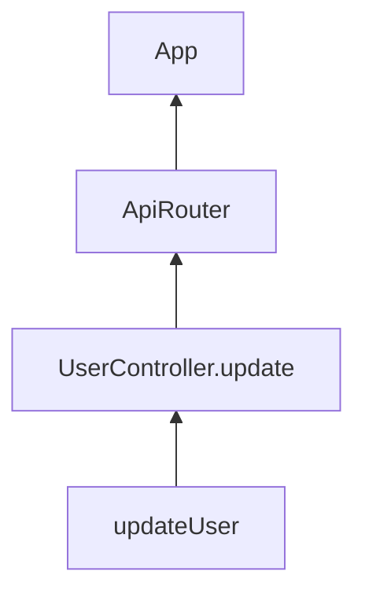

# 呼び出し元分析（Caller Analyzer）設計書

## 1. 概要

呼び出し元分析機能は、TypeScriptプロジェクト内の特定の関数やメソッドがどこから呼び出されているかを分析し、その呼び出し元の階層構造を可視化する機能です。

## 2. 機能要件

### 2.1 基本機能
- 関数の呼び出し元の特定
- メソッドの呼び出し元の特定
- 呼び出し階層の分析
- 呼び出し頻度の分析
- グラフの可視化（Mermaid形式）
- 特定シンボル間のパス検索
- 全呼び出し元の検索と分析

### 2.2 解析対象
- 関数呼び出し
- メソッド呼び出し
- コンストラクタ呼び出し
- イベントハンドラ
- コールバック関数
- 非同期関数の呼び出し
- プロパティアクセス経由の呼び出し

## 3. 技術設計

### 3.1 コアコンポーネント

```typescript
// 呼び出しグラフのノード
interface CallGraphNode {
    symbol: string;
    type: string;
    location: SymbolLocation;
    callers: CallGraphNode[];
    callees: CallGraphNode[];
}

// シンボルの位置情報
interface SymbolLocation {
    filePath: string;
    line: number;
    column: number;
    context: string;
}

// 呼び出し経路
interface CallPath {
    nodes: CallGraphNode[];
    edges: CallEdge[];
    startSymbol: string;
    endSymbol: string;
}

// 呼び出しエッジ
interface CallEdge {
    caller: CallGraphNode;
    callee: CallGraphNode;
    location: SymbolLocation;
}

// 呼び出しグラフ分析結果
interface CallGraphResult {
    paths: CallPath[];
    totalPaths: number;
    graphMermaidFormat?: string;
    outputPath?: string;
}

// 分析オプション
interface AnalyzerOptions {
    basePath: string;
    tsConfigPath?: string;
    includePatterns?: string[];
    excludePatterns?: string[];
}
```

### 3.2 解析プロセス

1. **初期化フェーズ**
   - プロジェクトの初期化
   - 出力ディレクトリの設定
   - 解析オプションの設定

2. **呼び出し元解析フェーズ**
   - ソースファイルの走査
   - 関数宣言の処理
   - クラス宣言の処理
   - 呼び出し式の解析

3. **階層構造分析フェーズ**
   - 呼び出しグラフの構築
   - パス検索の実行
   - 循環参照の検出

4. **可視化フェーズ**
   - Mermaid形式への変換
   - 出力ファイルの生成
   - タイムスタンプ付きファイル管理

## 4. 実装詳細

### 4.1 呼び出し元解析クラス

```typescript
class CallGraphAnalyzer {
    private project: Project;
    private nodeUtils: NodeUtils;
    private callGraph: Map<string, CallGraphNode>;
    private outputDir: string;

    constructor(project: Project, outputDir: string = '.symbols') {
        this.project = project;
        this.nodeUtils = new NodeUtils();
        this.callGraph = new Map<string, CallGraphNode>();
        this.outputDir = outputDir;
        this.ensureOutputDir();
    }

    // 呼び出しグラフの構築
    public buildCallGraph(): number;

    // 特定シンボル間のパス検索
    public findPathsFromTo(fromSymbol: string, toSymbol: string): CallGraphResult;

    // 全呼び出し元の検索
    public findAllCallers(symbol: string): CallGraphResult;

    // その他の内部メソッド
    private processFunctions(sourceFile: any): void;
    private processClasses(sourceFile: any): void;
    private processCallExpressions(node: Node, callGraphNode: CallGraphNode): void;
    private recordCallRelationship(caller: CallGraphNode, calleeName: string): void;
}
```

### 4.2 最適化戦略

- インクリメンタル解析によるパフォーマンス向上
- 出力ファイルのキャッシング
- メモリ使用量の最適化
- 深さ優先探索の効率化

### 4.3 特殊ケースの処理

- プロパティアクセス経由の呼び出し解析
- 型情報を利用した呼び出し先の特定
- コンテキスト情報の保持
- 位置情報の正確な追跡

## 5. エラー処理

### 5.1 想定されるエラー
- シンボル未検出エラー
- 解析深度超過エラー
- メモリ不足エラー
- 循環参照エラー
- ファイル出力エラー

### 5.2 エラーレスポンス
```typescript
interface AnalyzerError {
    code: string;
    message: string;
    symbol?: string;
    location?: SymbolLocation;
    suggestions?: string[];
}
```

## 6. 出力形式

### 6.1 Mermaid形式


### 6.2 JSON形式
```json
{
  "paths": [
    {
      "nodes": [
        {
          "symbol": "updateUser",
          "type": "method",
          "location": {
            "filePath": "src/services/UserService.ts",
            "line": 42,
            "column": 3,
            "context": "class UserService"
          }
        }
      ],
      "edges": [
        {
          "caller": "UserController.update",
          "callee": "updateUser",
          "location": {
            "filePath": "src/controllers/UserController.ts",
            "line": 27,
            "column": 5,
            "context": "method update"
          }
        }
      ],
      "startSymbol": "App",
      "endSymbol": "updateUser"
    }
  ],
  "totalPaths": 1,
  "graphMermaidFormat": "graph BT\n  A[updateUser] --> B[UserController.update]",
  "outputPath": ".symbols/updateUser_20240316_1227.md"
}
```

## 7. 使用例

```bash
# 基本的な使用方法
symref callers UserService.updateUser

# パス検索
symref path UserController.update Database.query

# 全呼び出し元の検索
symref all-callers AuthService.validate

# Mermaidグラフの出力
symref callers UserService.updateUser --format mermaid

# パターンによる制限
symref callers Database.query --include "src/services/**/*.ts"
```

## 8. 制限事項

- 動的な呼び出しの完全な解析は非対応
- eval()内からの呼び出しは解析対象外
- 大規模なプロジェクトでは解析に時間がかかる可能性あり
- メモリ使用量が増大する可能性あり（特に深い呼び出し階層の場合）
- 型情報が不完全な場合、呼び出し関係の特定が困難
- プロパティアクセス経由の呼び出しは型情報に依存
- 出力ファイルのサイズが大きくなる可能性あり 