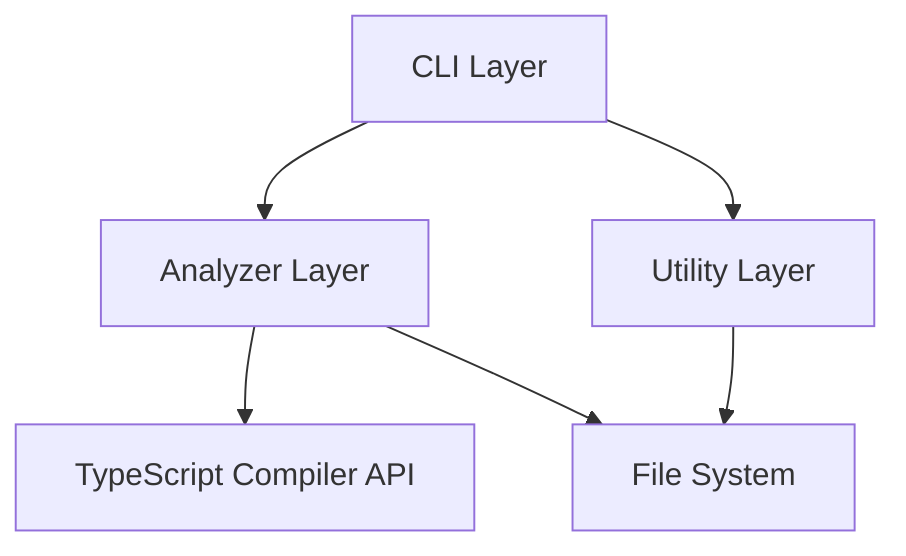
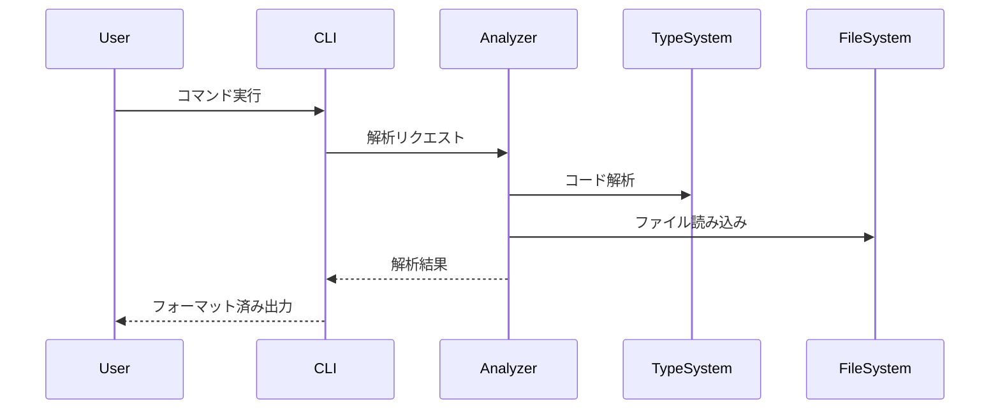

# symref システム設計書

## 1. システム概要

### 1.1 システムの目的
TypeScriptプロジェクトのシンボル参照関係を静的解析し、AIコードエージェントのコンテキスト制限による問題を解決するためのツール。

### 1.2 解決する課題
1. AIコードエージェントのコンテキスト制限による問題
   - コードベース全体の把握困難
   - エントリーポイントからの呼び出し関係の不可視
   - 依存関係の全体像の把握困難

2. コード品質の低下防止
   - 不適切な修正位置の選択
   - 依存関係の見落とし
   - デッドコードの生成

### 1.3 主要機能
1. シンボル参照解析
2. 未使用コード検出
3. 呼び出しグラフ分析
4. 呼び出し元分析

## 2. アーキテクチャ設計

### 2.1 全体構成



### 2.2 モジュール構成

#### 2.2.1 アナライザーモジュール（`src/analyzer/`）
- `SymbolReferenceAnalyzer.ts`: シンボル参照の解析
- `CallGraphAnalyzer.ts`: 呼び出しグラフの分析
- `SymbolFinder.ts`: シンボルの検索
- `ProjectManager.ts`: プロジェクト管理

#### 2.2.2 型定義モジュール（`src/types/`）
- `AnalyzerOptions.ts`: 解析オプション
- `CallGraphTypes.ts`: 呼び出しグラフ関連の型
- `SymbolTypes.ts`: シンボル関連の型

#### 2.2.3 CLIモジュール（`src/cli/`）
- コマンドハンドラー
- 引数パーサー
- 出力フォーマッター

#### 2.2.4 ユーティリティモジュール（`src/utils/`）
- ファイルシステム操作
- キャッシュ管理
- ヘルパー関数

### 2.3 データフロー



## 3. 機能詳細設計

### 3.1 シンボル参照解析（`SymbolReferenceAnalyzer`）

#### 3.1.1 責務
- シンボルの定義位置の特定
- 参照箇所の検出
- 参照タイプの分類
- コンテキスト情報の収集

#### 3.1.2 主要インターフェース
```typescript
interface SymbolReferenceAnalyzer {
    findReferences(symbol: string): ReferenceResult;
    analyzeUsage(symbol: string): UsageAnalysis;
    getDefinition(symbol: string): SymbolDefinition;
}
```

### 3.2 呼び出しグラフ分析（`CallGraphAnalyzer`）

#### 3.2.1 責務
- 関数呼び出しの追跡
- 呼び出し経路の探索
- 循環参照の検出
- グラフ生成

#### 3.2.2 主要インターフェース
```typescript
interface CallGraphAnalyzer {
    tracePath(from: string, to: string): CallPath[];
    findCallers(symbol: string): CallerInfo[];
    generateGraph(path: CallPath[]): MermaidGraph;
}
```

### 3.3 プロジェクト管理（`ProjectManager`）

#### 3.3.1 責務
- TypeScriptプロジェクトの初期化
- ソースファイルの管理
- コンパイラオプションの設定
- キャッシュ管理

#### 3.3.2 主要インターフェース
```typescript
interface ProjectManager {
    initialize(config: ProjectConfig): void;
    getSourceFiles(): SourceFile[];
    getCompilerOptions(): CompilerOptions;
    invalidateCache(): void;
}
```

## 4. 非機能要件

### 4.1 パフォーマンス要件
- 大規模プロジェクト（1000+ファイル）での応答時間: < 30秒
- メモリ使用量: 最大2GB
- キャッシュヒット率: > 80%

### 4.2 信頼性要件
- エラー発生率: < 0.1%
- クラッシュ回復時間: < 5秒
- データ整合性: 100%

### 4.3 保守性要件
- テストカバレッジ: > 80%
- コードドキュメント化率: > 90%
- モジュール独立性: 高

### 4.4 セキュリティ要件
- ファイルアクセス制限の遵守
- 設定ファイルの検証
- エラーメッセージでの機密情報非開示

## 5. 制約事項

### 5.1 技術的制約
- TypeScript 4.0以上
- Node.js 14.0以上
- メモリ使用量: 最大2GB

### 5.2 依存関係
- TypeScript Compiler API
- Node.js標準ライブラリ
- 最小限のサードパーティライブラリ

## 6. 将来の拡張性

### 6.1 拡張ポイント
1. 新しい解析タイプの追加
2. カスタム出力フォーマッター
3. プラグインシステム
4. IDE統合

### 6.2 予定される機能拡張
1. リアルタイム解析
2. インクリメンタル更新
3. マルチプロジェクト対応
4. カスタムルール定義 